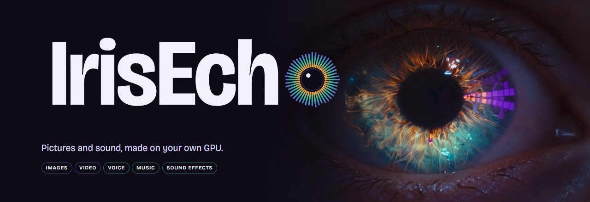
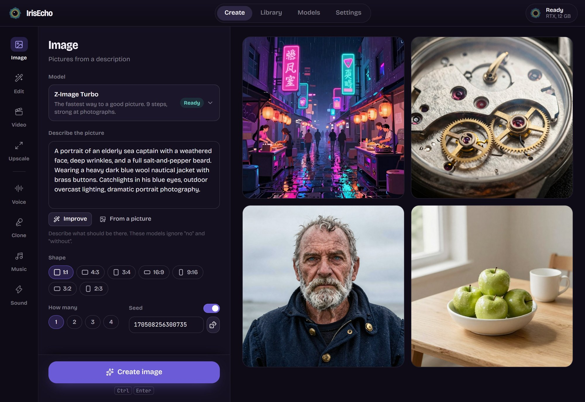
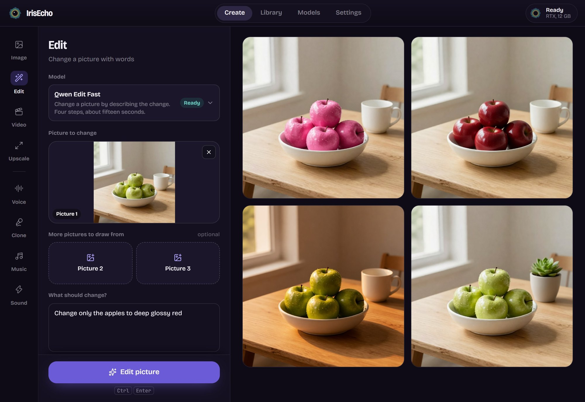
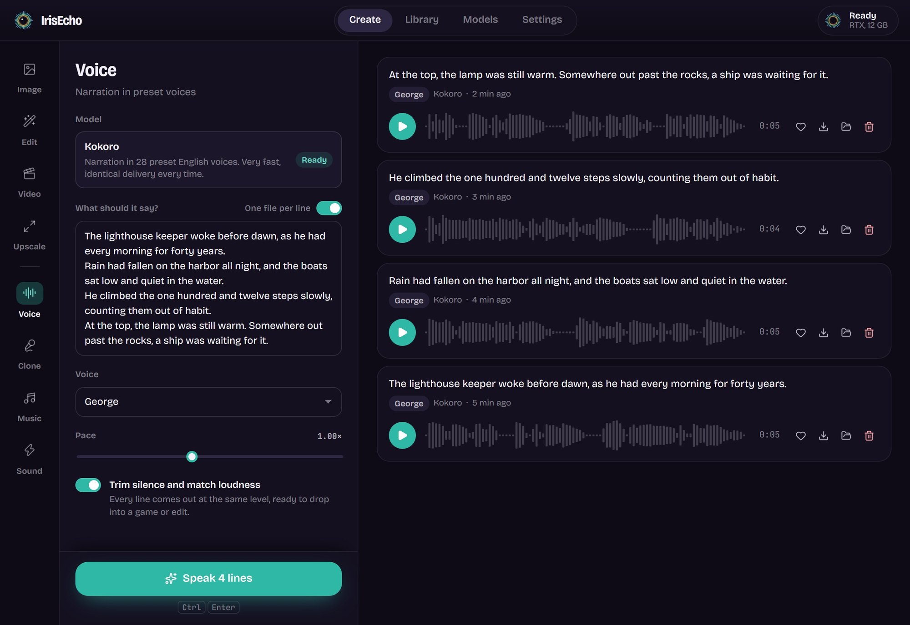
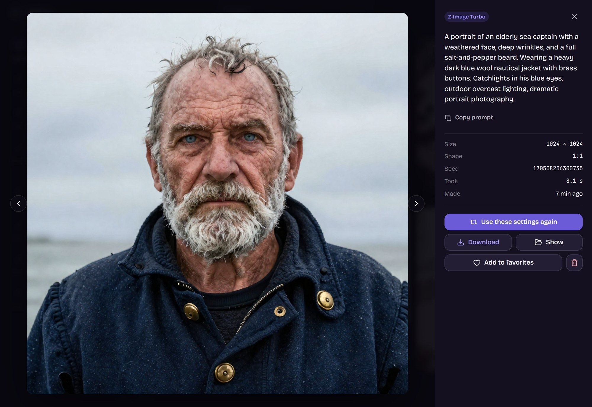
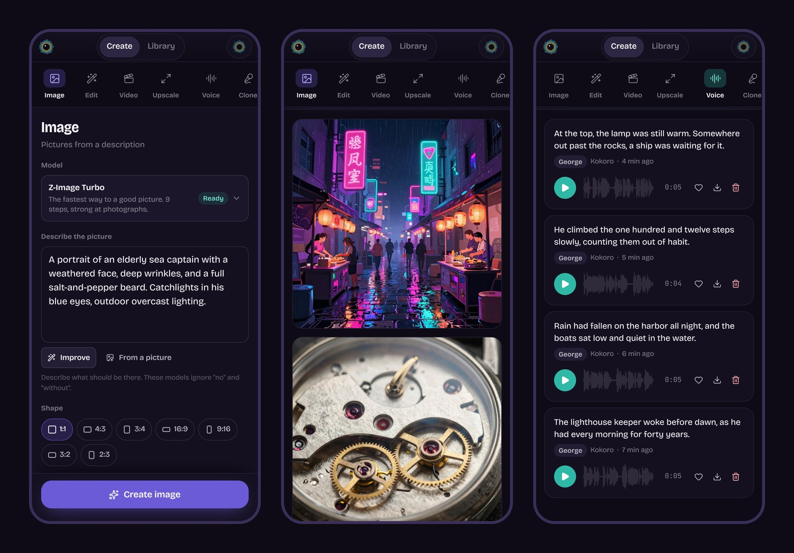
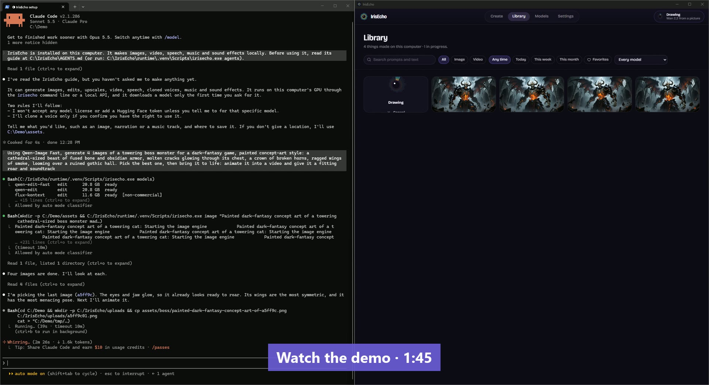

<p align="center">
  
</p>

<p align="center">
  <a href="LICENSE"></a>
  
  
  
</p>

IrisEcho is one desktop app for making images, edits, video, voices, music and
sound effects with open models on your own graphics card. It installs its own
engines, downloads each model the first time you choose it, and keeps a single
model on the GPU at a time, so one consumer card runs all of it. Nothing leaves
your computer except the downloads you ask for.

Use it at your desk, [from your phone](#from-your-phone), or hand it to your
coding agent: [give your agents generation capabilities](#give-your-agents-generation-capabilities).

<p align="center">
  
</p>

## What it makes

| Studio | What you do | Models |
|---|---|---|
| **Image** | Describe a picture; get photos, illustration, lettering that reads | Z-Image Turbo, FLUX.1 schnell, Qwen-Image, FLUX.1 dev / Krea\* |
| **Edit** | Say what should change in a picture; combine up to three | Qwen Edit (fast and careful), FLUX.1 Kontext\* |
| **Upscale** | Enlarge 2-4× and restore detail, no prompt needed | SeedVR2 |
| **Video** | 2-5 s clips from text, a first frame, a last frame, or both | Wan 2.2 |
| **Voice** | Narration in 28 preset voices, a whole script at once | Kokoro |
| **Clone** | A voice you have the right to use, from a 5-15 s sample, with performed laughs and sighs | Chatterbox, Chatterbox Turbo |
| **Music** | Beds, jingles and stingers from a few tags; seamless loops on the bar | ACE-Step 1.5 |
| **Sound** | One-shot effects: foley, UI sounds, impacts, ambience | Stable Audio 3 SFX\* |

<sub>\* Opt-in: non-commercial (FLUX.1 dev family) or gated (Stable Audio: accept the publisher's terms on Hugging Face and add a read token). IrisEcho shows each license and walks you through it.</sub>

**Improve** sits under every picture and video prompt: a small local model
(Qwen3-VL) rewrites a rough idea the way the chosen model likes it, or describes
a picture as a prompt, and you accept or undo the result. The **Library** is
searchable by the words in your prompts, with filters for studio, model, date
and favourites; a search is a link (`#/library?q=fox`).

Voice lines come out trimmed and loudness-matched, music loops are cut on whole
bars, cloned takes are ranked liveliest first, and pictures are saved with no
embedded prompts or settings.

<table>
  <tr>
    <td width="50%"></td>
    <td width="50%"></td>
  </tr>
  <tr>
    <td><sub><b>Edit</b> · say what should change; the rest of the picture is kept</sub></td>
    <td><sub><b>Voice</b> · a whole script at once, one file per line, levels matched</sub></td>
  </tr>
</table>

<p align="center">
  
</p>
<p align="center"><sub>Every result keeps its prompt, seed and settings, one click from making another. Everything shown here was made in IrisEcho.</sub></p>

## From your phone

**Your GPU is in the other room. Your phone is in your hand.** Turn on phone
access in Settings, point the phone's camera at the QR code, and IrisEcho opens
in its browser with a layout made for one hand. The computer does the work; the
phone asks and watches it arrive.

<p align="center">
  
</p>

- **Everything you make, from anywhere on your Wi-Fi.** Every studio works on
  the phone with the models you have set up on the computer: pictures, edits,
  video, voices, music, sound. Add a photo from the camera roll to edit or
  animate it.
- **Your library in your pocket.** Browse, search, play, favourite and download
  what you have made.
- **Nothing to install on the phone, no account, no cloud.** It is a page
  served by your own computer.
- **Yours to control.** Off until you switch it on. Each phone pairs once with a
  short-lived code, is listed in Settings, and can be revoked there. Models,
  settings and folders stay on the computer. The connection is plain HTTP, so
  use it on a network you trust ([details](SECURITY.md)).

## Give your agents generation capabilities

**Your coding agent can already write the game, the site, the video script.
With IrisEcho it can also make the art, the voice-over, the music and the sound
effects for it**, on your own GPU: no API keys, no per-image bill, nothing
uploaded.

<p align="center">
  <a href="docs/assets/agent-demo.mp4"></a>
</p>

<sub>One prompt to Claude Code on a fresh install: four pictures of a game boss
with Qwen-Image Fast, the agent picks one, animates it with Wan 2.2 and adds a
roar and a score. The waits are sped up; it all ran on one RTX 4070 SUPER.
[Watch the video](docs/assets/agent-demo.mp4) (1:45, with sound at the end).</sub>

IrisEcho ships with its own instructions for agents. Open Settings → Scripts
and coding agents, press **Copy a note for your assistant**, and paste it to
Claude Code, Codex or whatever works on your computer. The note tells the agent
where the guide is; the guide tells it everything else. Then just ask:

> *"Make four icon options for the inventory screen, record the narrator's
> lines from `script.txt`, and give me a 20-second loop for the menu."*

and the agent runs things like:

```sh
irisecho image "a brass compass, game inventory icon, centered, flat background" --count 4 --json --out assets/icons
irisecho say --file script.txt --voice bm_george --json --out assets/vo
irisecho music "chiptune, upbeat, bright lead" --bpm 140 --seconds 20 --loop --json --out assets/music
```

- **One queue with you.** If the app is open, the agent's jobs join its queue
  and show up in the window and your library as they finish. If it is closed,
  the commands run the engines themselves.
- **Made to be read by a program.** `--json` prints one object per job with the
  finished files; exit codes say whether it worked.
- **The whole app, not a subset.** Edits, upscaling, video and sound effects
  are reached through `irisecho api`, which finds the running app and signs the
  request.
- **You stay in charge of licenses.** An agent never accepts a model license or
  adds a token on its own; the guide tells it to stop and show you.

The guide is [AGENTS.md](core/src/irisecho_core/AGENTS.md); `irisecho agents`
prints it with your install's own paths filled in.

## Install

**Windows 11 with an NVIDIA RTX card (20-series or newer):** download
`IrisEcho_x.y.z_x64-setup.exe` from Releases and run it. The first launch sets up
a private Python environment (about a minute); after that it opens straight to
the app. Pick a studio, choose a model, and IrisEcho downloads what that model
needs.

The installer is not code-signed yet, so Windows SmartScreen may warn about an
unrecognized app: choose **More info → Run anyway**.

**Already have models?** On the Models page, point IrisEcho at a folder you
already use (a ComfyUI `models` folder, for example). It finds matching files,
checks each against its recorded hash, and uses them in place without copying
or changing anything there. Models appear as their files are confirmed; one
button then installs the engines they run on.

**Where things are kept.** Everything IrisEcho installs or makes lives in one
folder, `%LOCALAPPDATA%\IrisEcho` on Windows (Settings shows it, and lets you
keep models and creations somewhere else). It brings its own Python and never
touches one you already have. Uninstalling removes the app and leaves that
folder alone, your creations and downloaded models included; delete the folder
yourself if you want everything gone.

<details>
<summary><b>Run from source</b></summary>

Needs [uv](https://docs.astral.sh/uv/), Node.js 20+, and for the desktop app a
Rust toolchain.

```sh
git clone https://github.com/ribbiteer/irisecho
cd irisecho
python scripts/dev_setup.py        # git hooks for contributors
(cd ui && npm ci && npm run build) # the web UI
uv sync
uv run irisecho                    # opens the app in a browser window
```

Build the installer for your platform with `uv run python scripts/build_desktop.py`.
</details>

## From the command line

Everything the app does is scriptable, including whole cue sheets:

```sh
irisecho setup kokoro                                        # install and download
irisecho say --file lines.txt --voice bm_george --out vo/    # id|text per line
irisecho clone "Correct! [chuckle] Ten points." --ref host.wav --takes 3
irisecho music "synthwave, driving, analog synth" --bpm 110 --seconds 30 --loop
irisecho image "a lighthouse at blue hour" --aspect 16:9 --count 4
irisecho link D:\ComfyUI\models                              # reuse weights you have
irisecho models                                              # what is ready, and licenses
```

If the app is open, these commands hand their work to it, so there is still one
queue and one model on the GPU; if it is not, they run the engines themselves.

For programs rather than people, add `--json`, and reach the rest of the app
with `irisecho api`:

```sh
irisecho image "a lighthouse at blue hour" --json            # one JSON object per job on stdout
irisecho api POST jobs '{"model": "sa3-sfx", "params": {"prompt": "a door closing"}}' --wait
irisecho agents                                              # the full guide for agents and scripts
```

## How it works

- **One engine on the GPU at a time.** Every engine (a private ComfyUI for
  pictures and video, and separate workers for Kokoro, Chatterbox, ACE-Step and
  Stable Audio) lives in its own Python environment. IrisEcho frees the GPU from
  one before starting the next, so versions never clash and a 12 GB card is
  enough.
- **Pinned and verified.** Every model file is pinned to a repository commit and
  checked against a recorded hash; every engine is installed from a pinned
  source. Engines run offline, so nothing is fetched behind your back.
- **Private by default.** The app listens on this computer only, with a
  per-session token. No accounts, no analytics, no telemetry. Closing the app
  stops every engine it started.

## Platforms

| | Status | Notes |
|---|---|---|
| Windows 11 + NVIDIA RTX 20-series or newer | Supported | 8 GB VRAM minimum, 12 GB recommended; RTX 50 cards use their own builds, not yet tested |
| macOS on Apple Silicon | Coming soon | In progress: voice, music and Z-Image first. Not tested yet |
| Linux + NVIDIA | Coming soon | In progress: the core is written to run there, from source. Not tested yet |

## Models and licenses

IrisEcho never ships model weights. Each comes from its publisher, under the
publisher's license, when you choose it. Most are Apache-2.0 or MIT; the few
that are non-commercial or gated are off until you turn them on, and are
labelled wherever they appear. [MODELS.md](MODELS.md) lists every model, its
license, commercial terms, size and source.

## Roadmap

- [x] Foundations: license, identity-safe tooling, brand
- [x] Job queue, GPU handover, verified downloads, voices
- [x] Pictures: private ComfyUI, open models, then gated ones
- [x] Sound: voice cloning, music, sound effects, clean-up
- [x] Editing, upscaling and video
- [x] Windows installer
- [x] Prompt writer and library search
- [x] Phone and LAN access
- [ ] macOS and Linux
- [ ] Signed releases

## Contributing

Issues and pull requests are welcome. Please read
[CONTRIBUTING.md](CONTRIBUTING.md) first: commits need a DCO sign-off, and the
repository's hooks keep personal details out of history.

## License

IrisEcho is free software under the
[GNU Affero General Public License v3.0 or later](LICENSE). The engines and
libraries it installs keep their own licenses; see
[THIRD_PARTY_NOTICES.md](THIRD_PARTY_NOTICES.md). The brand assets in
[docs/assets](docs/assets) are covered by the same license; the interface uses
[Bricolage Grotesque](https://github.com/ateliertriay/bricolage) and
[JetBrains Mono](https://github.com/JetBrains/JetBrainsMono) under the SIL Open
Font License 1.1.
